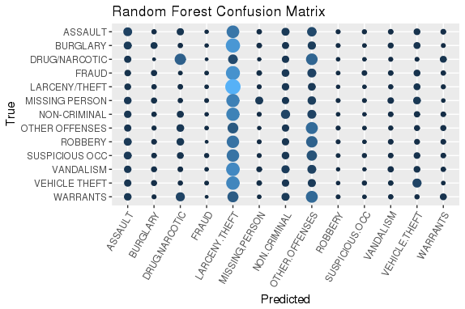
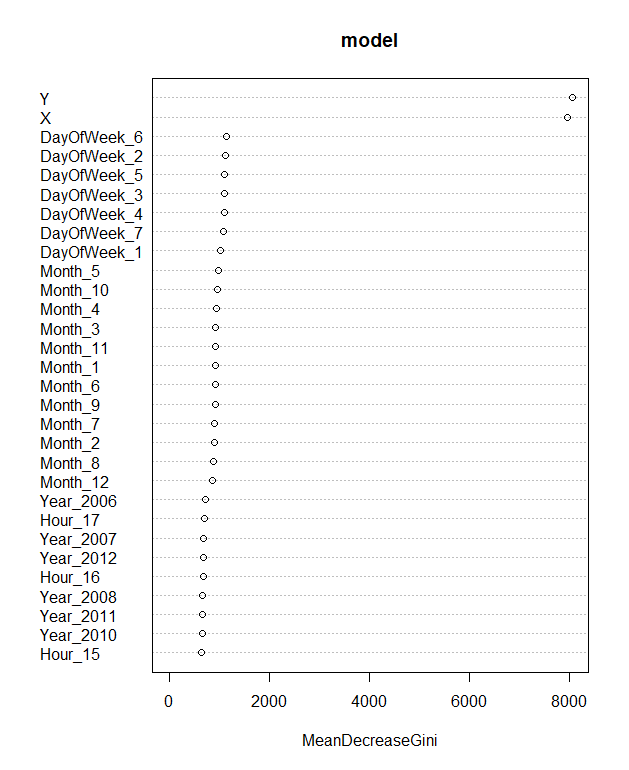

```{r setup, include=FALSE}
knitr::opts_chunk$set(echo = TRUE)
knitr::opts_chunk$set(tidy.opts=list(width.cutoff=60),tidy=TRUE)
```

## Introduction

For our final project, we decided to participate in Kaggle's San Francisco Crime Classification competition. The goal of the competition is to correctly classify the category of a reported crime, given information about the reported time and location of the crime. 

The provided training dataset contains all incidents in the San Francisco Police Department's Crime Incident Reporting system that occurred during odd weeks (i.e. every other week) from 1/2003 to 5/13/2015. The test set contains the incidents from even weeks in the same time period.

## Setup

```{r, warning=FALSE, echo=FALSE, message=FALSE, include=FALSE}
library(tidyverse)
library(ggmap)   # for map visualizations
library(nnet)   # for multinomial logistic regression
library(rpart)  # for CART 
library(caret)  # for KNN
library(MLmetrics)  # for KNN 
library(dummies)
source("data_cleaning.R")   # load in cleaned training and testing data
map <- get_map(location="sanfrancisco",zoom=12,source="google")   # plot map base for SF

# Produce some alternate data frames used for visualization
set.seed(495)
df_small <- df %>%   # smaller dataframe to reduce computation time on some visualizations
  sample_n(10000)
toptwelve <- c("LARCENY/THEFT", "OTHER OFFENSES", "NON-CRIMINAL", "ASSAULT", "DRUG/NARCOTIC", "VEHICLE THEFT", "VANDALISM", "WARRANTS", "BURGLARY", "SUSPICIOUS OCC", "MISSING PERSON", "ROBBERY")   # top 12 categories of crime
df_top12 <- df %>%
  filter(Category %in% toptwelve)
```

## Exploratory Data Analysis (EDA)

We want to first get a sense of what our data look like overall. First, we see how many crimes there are of each category:

```{r, echo=FALSE}
df %>%
  mutate(shortcat = substr(Category,0,10)) %>%
  group_by(shortcat) %>%
  summarise(n=n()) %>%
  arrange(desc(n)) %>%
  ggplot(aes(x=reorder(shortcat,-n), y=n)) + 
    geom_bar(stat="identity") + 
    theme(axis.text.x = element_text(angle = 90, hjust = 1)) + 
    labs(title="Frequency of crimes",x="Category",y="Frequency")
```

We see that most observations belong to the top 13 or so categories, with the other 26 categories making up a relatively small fraction of the total observations. As a sidenote, the distribution of categories roughly follows a power-law distribution (see [Zipf's Law](https://en.wikipedia.org/wiki/Zipf%27s_law), e.g.), which is expected in naturally occurring count data.

Next, we examine overall distributions of crime by location and over time.

```{r, echo=FALSE}
ggmap(map) +
  geom_point(
    data=df_small, 
    aes(x=X, y=Y),
    show.legend=FALSE,
    alpha=0.125
  ) +
  labs(x="Longitude",y="Latitude")
```

Clearly, crime is concentrated in the downtown area of San Francisco, with pockets in the southeast corner and along Mission St. This is expected, as it roughly aligns with overall population/activity density (perhaps barring the southeast corner).

```{r, echo=FALSE}
df %>%
  filter(Year < 2015) %>%   # incomplete data for 2015
  group_by(Year) %>%
  summarize(num=n()) %>%
  ggplot() +
    geom_bar(aes(x=Year, y=num), stat="identity") +
    labs(
      title="Overall Crime by Year",
      x="Year",
      y="Number of Crime Reports"
    )
```

The amount of crime per year seems to remain relatively consistent over time.

```{r, echo=FALSE}
df %>%
  filter(Year < 2015) %>%
  group_by(Month) %>%
  summarize(num=n()) %>%
  ggplot() +
    geom_bar(aes(x=Month, y=num), stat="identity") +
    labs(
      title="Overall Crime by Month",
      x="Month",
      y="Number of Crime Reports"
    )
```

Crime seems to peak in May and September, with slumps in late winter (Jan-Mar) and late summer (Jul-Sep). Overall, though, it seems relatively consistent over the different months.

```{r, echo=FALSE}
df %>%
  mutate(DayOfWeek = wday(Dates, label=TRUE)) %>%
  group_by(DayOfWeek) %>%
  summarize(num=n()) %>%
  ggplot() +
    geom_bar(aes(x=DayOfWeek, y=num), stat="identity") +
    labs(
      title="Overall Crime by Day of Week",
      x="Day of Week",
      y="Number of Crime Reports"
    )
```

Crime peaks on Fridays, from a low on Sundays, though occurrences are pretty consistent throughout the week.

```{r, echo=FALSE}
df %>%
  group_by(Hour) %>%
  summarize(num=n()) %>%
  ggplot() +
    geom_bar(aes(x=Hour, y=num), stat="identity") +
    labs(
      title="Overall Crime by Hour of Day",
      x="Hour of Day",
      y="Number of Crime Reports"
    )
```

Crime reports roughly align with normal waking hours, dipping from 3-7AM and peaking after work lets out at 5. There are unusual spikes at 12AM and 12PM, which may arise from a combination of "lunchtime" and artifacts of the data collection/recording process.

```{r, echo=FALSE}
df %>%
  mutate(DayOfWeek = wday(Dates, label=TRUE)) %>%
  group_by(DayOfWeek, Hour) %>%   # 01 is Sunday, 07 is Saturday
  summarize(num=n()) %>%
  ggplot() +
  geom_point(aes(x=DayOfWeek, y=Hour, size=num, col=num)) +
  scale_color_gradient(low="blue", high="orange") +
  scale_y_reverse() +
  labs(
    title="Crime Occurrences by Hour and Day of Week",
    y="Hour of Day",
    x="Day Of Week"
  ) +
  guides(color=FALSE, size=FALSE)
```

Interestingly enough, crimes occur at different times on weekends and weekdays. We notice that on weekends, crime moves later into the night than on weekdays, which makes intuitive sense, since more people are up late at night on weekends.

### EDA by Category

Now that we have some sense of what the dataset looks like overall, we produce some visualizations to see how the different crime categories differ from each other (and from overall trends). The goal of these visualizations is to gain some insight into variables that might be useful for discriminating between different crime categories.

Here, we examine some time trends. We limit our exploration to the top twelve most-common categories of crime, since our models will generally only predict the most common categories. Though it could be interesting to see trends in the other categories, such trends would be much less useful if our goal is overall classification performance.

First, we visualize crime categories by month. We normalize all of the plots in the next section (i.e. we account for the overall proportion of the crime category) so that we can focus on the shapes of the distributions, and not just see that larceny/theft (the most common crime category, by far) has a lot of occurrences all the time. 

```{r, echo=FALSE}
df %>%
  filter(
    Year < 2015,   # remove last 5 months of data to avoid bias
    Category %in% toptwelve) %>%
  group_by(Category, Month) %>%
  summarize(num_mo = n()) %>%
  ungroup() %>%
  group_by(Category) %>%
  mutate(num_cat_prop = num_mo/sum(num_mo)) %>%
  ggplot() +
    geom_bar(aes(x=Month, y=num_cat_prop), stat="identity") +
    facet_wrap(~Category) +
    labs(
      title="Crimes by Month (Normalized)",
      y="Amount of Crime Committed (Proportion)",
      x="Month"
    )
```

There is not much significant variation in crimes committed by month, by category. Most crime categories follow the overall trends of May and September peaks.

Next, we visualize crime categories by hour.

```{r, echo=FALSE}
df %>%
  filter(Category %in% toptwelve) %>%
  group_by(Category, Hour) %>%
  summarize(num_hour = n()) %>%
  ungroup() %>%
  group_by(Category) %>%
  mutate(num_cat_prop = num_hour/sum(num_hour)) %>%
  ggplot() +
  geom_bar(aes(x=Hour, y=num_cat_prop), stat="identity") +
  facet_wrap(~Category) +
  labs(
    title="Crimes by Hour of Day (Normalized)",
    y="Amount of Crime Committed (Proportion)",
    x="Hour of Day"
  )
```

Here, there is much more variation in the trends by category here. While most crimes still generally follow the overall day trends (lull late at night, peak right after work), there are significant deviations from this norm.

For example, burglary (property stolen when owner is not present) peaks when people wake up (around 9) and get back from work (around 5), presumably because those would be times that victims will notice that their property is missing. Robbery (property stolen when owner is present), on the other hand, peaks late at night, which lines up with stereotypes of muggings, late-night break-ins, etc.

Also, we see those strong peaks at 12 AM and 12PM in most categories, but particularly in suspicious occurences. Perhaps people are more paranoid at midnight, or have more time to see suspicious activity at lunch.

Finally, we plot by minute to show an interesting artifact of the data collection process.

```{r, echo=FALSE}
df %>%
  filter(Category %in% toptwelve) %>%
  group_by(Category, Minute) %>%
  summarize(num_min = n()) %>%
  ungroup() %>%
  group_by(Category) %>%
  mutate(num_cat_prop = num_min/sum(num_min)) %>%
  ggplot() +
  geom_bar(aes(x=Minute, y=num_cat_prop), stat="identity") +
  facet_wrap(~Category) +
  labs(
    title="Crimes by Minute of Hour (Normalized)",
    y="Amount of Crime Committed (Proportion)",
    x="Minute of Hour"
  )
```

Police tend to record reported times in five-minute increments, with tendencies to round to the hour or half-hour, and slightly less so for fifteen-minute increments. The plot for robbery is a very clear example of this trend.

Not all crimes, though, are rounded in the same way. We notice that drug/narcotic crimes and warrants see to show less bias toward the five-minute increments (though it still exists). We suspect that this is because those crimes are more "real-time", with police initiating the crime-reporting process (rather than e.g. assault, where the crime happens and is then reported).

To capture this effect, we code a variable `MultFive`, which records whether an incident is reported as occurring in a minute that is a multiple of five.

In general, we can conclude that time of day should have some discriminatory power. Since all of the above plots were normalized, though, it is difficult to see how the differences in trends would directly translate into useful features for classification.

To get a little idea of what features could be useful for classification, we plot the most common crime by hour and day of week.

```{r, echo=FALSE}
df %>%
  mutate(DayOfWeek = wday(Dates, label=TRUE, abbr=TRUE)) %>%
  group_by(DayOfWeek, Hour) %>%   # 01 is Sunday, 07 is Saturday
  summarize(
    num=n(),
    cat=names(sort(table(Category),decreasing = TRUE))[1]) %>%   # Most common crime
  ggplot() +
  geom_point(aes(x=DayOfWeek, y=Hour, col=cat)) +
  scale_y_reverse() +
  labs(
    title="Most Common Crime by Hour and Day of Week",
    y="Hour of Day",
    x="Day Of Week",
    color="Crime Category"
  )
```

While larceny/theft is the most common crime for most hours (which makes sense, since it's the most common crime in general), there are some very interesting trends in this chart. If someone is calling the police on Sunday morning, they are most likely reporting something non-criminal. Reports late at night on weekends are likely assaults. Reports in the morning are generally other offenses, i.e. traffic violations. All of these trends match our stereotypes of when these crimes might occur, which is interesting. Importantly, they show that hour/day-of-week interactions can be very useful to a model.

### Shiny App

To explore spatial trends and spatial/temporal interactions, we built a Shiny app. The app can be accessed [here](https://jche.shinyapps.io/deploy/). The code for the app is in `shiny_app.R`.

The Shiny app gives us a lot of information to work with. For example, we noticed that other offenses & assault have multimodal distributions (northeast and southeast), drug/narcotic is very tightly centered (Tenderloin, Mission), and vehicle thefts are spread out throughout the city. In addition, we noticed clear changepoints in time, such as a decrease in 2006. 


## Model Fitting

We fit several models. We quickly discarded CART, KNN, and K-Means. We spent more time on multinomial logistic regression and random forests, trying to optimize our Kaggle score. The random forest gave the lowest Kaggle score. 

### Random Forest 

We fit a wide range of random forest models. Unfortunately, we ran into issues when we tried to train on more than 100000 observations, which was less than one-eighth of our available data. The rough learning curve below shows that more observations would likely lead to better performance.

```{r, echo=FALSE}
# To generate these curves, we manually fit a number of models and recorded training times. The code is not shown here, since it is essentially just a for loop over the hyperparameter of training set size.

# Show learning curve (num_train, OOB error rate, time taken)
temp <- data.frame(c(25000, 50000, 75000, 100000), c(75.76, 74.92, 74.2, 73.66), c(231.62, 624.8, 1076.03, 1201.42))
names(temp) <- c("num_train", "OOB_err", "train_time")

ggplot(temp) +
  geom_point(aes(x=num_train, y=OOB_err)) +
  labs(
    title="Random Forest Learning Curve",
    y="Out-of-bag error",
    x="Number of training samples")
```

Also, the training-time curve indicates that it may be memory that's the limiting factor, and not necessarily runtime.

```{r}
ggplot(temp) +
  geom_point(aes(x=num_train, y=train_time)) +
  labs(
    title="Training Time Curve",
    y="Time to train model",
    x="Number of training samples")
```

As such, we take our results here to be preliminary. If we were actually to compete in the Kaggle competition, we would want to train on much more data.

First, we show the code used to train the model that gave us the best (Kaggle) performance. The variables used in this model were:

- `X` and `Y`: location coordinates, scaled to have unit mean and variance

- `PdDistrict`: police district, coded as a dummy variable

- `Year`, `Month`, `DayOfWeek`, and `Hour`: coded as dummy variables (i.e. "one-hot encoded")

```{r, eval=FALSE, include=FALSE}
# Build training set
xy_scaled <- df %>% 
  select(X,Y) %>%
  scale()   # Normalize columns
df_onehot <- df %>%
  as.data.frame() %>%   # avoid data.table errors
  select(PdDistrict, Year, Month, DayOfWeek, Hour, Category) %>%
  mutate_all(as.factor) %>%
  dummy.data.frame(names=c("PdDistrict", "Year", "Month", "DayOfWeek", "Hour"), sep="_")
df_full <- cbind(xy_scaled, df_onehot)

# Build testing set
test_xy_scaled <- test_df %>% 
  select(X,Y) %>%
  scale()   # Normalize columns
test_df_onehot <- test_df %>%
  as.data.frame() %>%   # avoid data.table errors
  select(PdDistrict, Year, Month, DayOfWeek, Hour) %>%
  mutate_all(as.factor) %>%
  dummy.data.frame(names=c("PdDistrict", "Year", "Month", "DayOfWeek", "Hour"), sep="_")
test_df_full <- cbind(test_xy_scaled, test_df_onehot)
```

With these variables, we fit the model using the `randomForest` package. Because we worked on the R server, we couldn't use the `ranger` package, which (reportedly) is a faster Rcpp-based version of the forest (apparently the server's C++ package is "out of date").

```{r, eval=FALSE}
tic()
model <- randomForest(as.factor(Category) ~ ., data=train)   # actually only use a sample of train
toc()
# save(model, file="rf_withxy.rda")
```

The confusion matrix for our model on the training set is below. We only plot the top few categories to keep it relatively manageable.

```{r,include=FALSE,eval=FALSE}
# Note: this confusion matrix is kind of messy, and was built for when we only predicted on the top 13 categories of crime. If you want to run the code, just filter the training dataset to only have the top 13 categories of crime before training the model.

confusion <- model$confusion
tot <- train %>%
  group_by(Category) %>%
  summarise(n=n()) 
denom <- cbind(tot$n,tot$n,tot$n,tot$n,tot$n,tot$n,tot$n,tot$n,tot$n,tot$n,tot$n,tot$n,tot$n,rep(1,13))
#dividing counts by the total number of crimes in each category 
props <- data.frame(confusion/denom)
props <- props %>%
  select(-class.error)
props <- tibble::rownames_to_column(props,"true")
#changing the format of the proportions from long to wide 
plot_props <- gather(props,guess,percent,-true)
#plotting the confusion matrix with color and size based on the proportions 
plot_props %>%
  mutate(
    true = as.factor(true),
    guess = as.factor(guess)
  ) %>%
  ggplot(aes(x=guess,y=true,color=percent,size=percent)) + 
  geom_point() +
  theme(axis.text.x = element_text(angle = 60, hjust = 1)) +
  guides(color = FALSE, size = FALSE) + 
  labs(x="Predicted",y="True",title="Random Forest Confusion Matrix") +
  scale_y_discrete(limits = rev(levels(foo$true)))
```



Nicely enough, RFs also allow us to view variable importance plots. Unfortunately, 

```{r, eval=FALSE}
varImpPlot(model)
```

 

The plot shows that spatial information is highly useful. Though we tried to engineer some other features to take advantage of this, they didn't end up working out in the limited time we had. 

Things that we tried include:

- *Reducing the number of variables used*: We tried only using isWeekend (instead of 7 days of week), excluding year information, and clumping hour variables into bins of 3

- *Adding more spatial variables*: We tried overlaying spatial grids of varying coarseness on the data, checking whether the crime was reported to be at a street intersection, and recording whether the crime was on certain streets

Obviously, we didn't exhaustively search the space of these variations, but in general, it seemed like the most basic rf performed the best, at least in the absence of extensive hyperparameter tuning.

We also ran gridsearches on hyperparameter space, tuning `ntree` (the number of trees to grow), `mtry` (the number of variables to try at each split), and `nodesize` (the minimum size of terminal nodes). The gains received from these searches were marginal, and given our limited computational resources, we decided that they were not worth the effort.

None of this code is outputted in this `.html` file, but it you're interested, some of it is in the `.Rmd`.

```{r, eval=FALSE, include=FALSE}
# Code for spatial grid (look familiar?)

# Save means/sd so that we can regrid/rescale test data appropriately
mean_x <- mean(df$X)
sd_x <- sd(df$X)
mean_y <- mean(df$Y)
sd_y <- sd(df$Y)

# Record info needed to place grid on data
min_x <- min(xy_scaled[,"X"])
min_y <- min(xy_scaled[,"Y"])
max_x <- max(xy_scaled[,"X"])
max_y <- max(xy_scaled[,"Y"])
x_range <- max_x - min_x
y_range <- max_y - min_y
num_grid <- 6
x_grid_size <- x_range / num_grid
y_grid_size <- y_range / num_grid
X_scaled <- xy_scaled[,"X"]
Y_scaled <- xy_scaled[,"Y"]

df_onehot <- df %>%
  as.data.frame() %>%   # avoid data.table errors
  mutate(
    X = X_scaled,
    Y = Y_scaled,
    x_fold = ifelse(   # randomForest does not like "-" in variable names
      floor(X / x_grid_size) < 0,
      str_c("n", -floor(X / x_grid_size)), 
      as.character(floor(X / x_grid_size))),
    y_fold = ifelse(   # randomForest does not like "-" in variable names
      floor(Y / y_grid_size) < 0,
      str_c("n", -floor(Y / y_grid_size)), 
      as.character(floor(Y / y_grid_size))),
    Fold = str_c("x", x_fold, "y", y_fold)
  )
```

```{r, include=FALSE}
# Note that street information is in the df object. We looked at StreetBlock, IsIntersection, and whether the street was some of the most popular streets.
```

Also, the code to submit our predictions is suppressed.

```{r, eval=FALSE, include=FALSE}
preds <- predict(model, newdata=test_df_full, type="prob")
submission <- data.frame(preds) %>%
  mutate(Id = as.integer(row_number()-1))
colnames(submission) = c(colnames(preds), "Id")

realnames <- c("Id", "ARSON", "ASSAULT", "BAD CHECKS", "BRIBERY", "BURGLARY", "DISORDERLY CONDUCT", "DRIVING UNDER THE INFLUENCE", "DRUG/NARCOTIC", "DRUNKENNESS", "EMBEZZLEMENT", "EXTORTION", "FAMILY OFFENSES", "FORGERY/COUNTERFEITING", "FRAUD", "GAMBLING", "KIDNAPPING", "LARCENY/THEFT", "LIQUOR LAWS", "LOITERING", "MISSING PERSON",  "NON-CRIMINAL", "OTHER OFFENSES", "PORNOGRAPHY/OBSCENE MAT", "PROSTITUTION", "RECOVERED VEHICLE", "ROBBERY", "RUNAWAY", "SECONDARY CODES", "SEX OFFENSES FORCIBLE",  "SEX OFFENSES NON FORCIBLE", "STOLEN PROPERTY", "SUICIDE", "SUSPICIOUS OCC", "TREA", "TRESPASS", "VANDALISM", "VEHICLE THEFT", "WARRANTS", "WEAPON LAWS")
submission <- submission[realnames]

# Write output
write_csv(submission,"submission_rf2.csv")
```


### Multinomial Logistic Regression

We also fit several multinomial logistic models, using different predictors and training on different portions of the data. The code below creates lists of the 13 most common categories and the 26 least common categories, to be used later while creating the submission. 

```{r,eval=FALSE}
#filtering data to only include the top 13 categories
df_filt <- df %>%
  filter(Category %in% top13)
#creating alphabetic list of top 13 categories and non-top 13 categories
top13 <-  df %>%
  group_by(Category) %>%
  summarise(n=n()) %>%
  arrange(desc(n)) %>%
  head(13) %>%
  arrange(Category)
not_top13 <- df %>%
  group_by(Category) %>%
  summarise(n=n()) %>%
  arrange(n) %>%
  head(26) %>%
  arrange(Category)
```

We used models with a variety of predictors, some predicting for the entire for all 39 categories (when data=df), some predicting for only top 13 cateogories (when data=df_filt). These are all models that were tested on Kaggle.
```{r,eval=FALSE}
#mod1 <- multinom(Category ~ as.factor(PdDistrict)+Hour+Month,data=df_filt)
#mod2 <- multinom(Category ~ as.factor(PdDistrict)+Hour+Month+DayOfWeek+mutl_five,data=df_filt)
#mod3 <- multinom(Category ~ X + Y + as.factor(PdDistrict)+DayOfData+Minute+Hour,data=df_filt)
#mod4 <- multinom(Category ~ X + Y + as.factor(PdDistrict)+DayOfData+Hour+Month+DayOfWeek,data=df_filt)
#mod5 <- multinom(Category ~  as.factor(PdDistrict)+as.factor(Month)+as.factor(DayOfWeek),data=df_filt)
#mod6 <- multinom(Category ~ as.factor(PdDistrict)+DayOfWeek+Month,data=df)
```

This fits the final model, and uses it to predict categories for the test set. 

```{r,eval=FALSE}
mod7 <- multinom(Category ~ X + Y +DayOfData,data=df_filt) #the model that got the best score on Kaggle
#predicting values for the test set
x <- predict(object=mod7,newdata=test_df,"probs")
x <- data.frame(x)
y <- data.frame(matrix(0,nrow=nrow(test_df),ncol=26))
#combining the predictions with a matrix of zeros (so that each observation is given a 0% chance of being categories that are not in the top 13)
submission <- data.frame(test_df$Id,x,y)
names(submission) = c("Id",top13$Category,not_top13$Category)
write_csv(submission,"zip/submission_multinom7.csv")
zip(zipfile = 'Submission_zipped.zip', files = 'zip')
```

### Other unused approaches 

Suppressed here is some code for the CART, kNN, and k-means clustering methods that we tried but did not end up using.

```{r,eval=FALSE, include=FALSE}
# CART

# Set up class weights
weights <- df %>%
  group_by(Category) %>%
  summarize(
    prop=n()/dim(df)[1],
    weights = log(1/prop)
  )
cart_df <- df %>%
  left_join(weights, by="Category")

# Fit model
model_formula <- as.formula(as.factor(Category) ~ X+Y+Month+as.factor(PdDistrict)+Hour+Year)
tree_parameters <- rpart.control(maxdepth = 10)
model_CART <- rpart(model_formula, data = cart_df, weights=weights, control=tree_parameters)

# Plot
plot(model_CART, margin=0.25); text(model_CART, use.n = TRUE)

# Summary
summary(model_CART)
print(model_CART)
```


```{r, eval=FALSE}
# kNN

# Need to scale variables for kNN to work
xy_scaled <- df %>% 
  select(X,Y) %>%
  scale()   # Normalize columns
df_onehot <- df %>%
  as.data.frame() %>%   # avoid data.table errors
  select(PdDistrict, DayOfWeek, Hour) %>%
  mutate_all(as.factor) %>%
  dummy.data.frame(names=c("PdDistrict", "DayOfWeek", "Hour"), sep="_") %>%
  mutate(   # Use 8 hour variables instead of 24
    time1 = Hour_0 | Hour_1 | Hour_2,
    time2 = Hour_3 | Hour_4 | Hour_5,
    time3 = Hour_6 | Hour_7 | Hour_8,
    time4 = Hour_9 | Hour_10 | Hour_11,
    time5 = Hour_12 | Hour_13 | Hour_14,
    time6 = Hour_15 | Hour_16 | Hour_17,
    time7 = Hour_18 | Hour_19 | Hour_20,
    time8 = Hour_21 | Hour_22 | Hour_23
  )
df_onehot <- df_onehot %>%
  select(-starts_with("Hour"))

df_full <- cbind(xy_scaled, df_onehot)

# Gather training sample (size doesn't really matter here, since kNN just memorizes)
set.seed(495)
train_ind <- sample(seq_len(nrow(df_full)), size = 700000)
train <- df_full[train_ind, ]

# Build test set
test_xy_scaled <- test_df %>% 
  select(X,Y) %>%
  scale()   # Normalize columns
test_df_onehot <- test_df %>%
  as.data.frame() %>%   # avoid data.table errors
  select(PdDistrict, DayOfWeek, Hour) %>%
  mutate_all(as.factor) %>%
  dummy.data.frame(names=c("PdDistrict", "DayOfWeek", "Hour"), sep="_") %>%
  mutate(
    time1 = Hour_0 | Hour_1 | Hour_2,
    time2 = Hour_3 | Hour_4 | Hour_5,
    time3 = Hour_6 | Hour_7 | Hour_8,
    time4 = Hour_9 | Hour_10 | Hour_11,
    time5 = Hour_12 | Hour_13 | Hour_14,
    time6 = Hour_15 | Hour_16 | Hour_17,
    time7 = Hour_18 | Hour_19 | Hour_20,
    time8 = Hour_21 | Hour_22 | Hour_23
  )
test_df_onehot <- test_df_onehot %>%
  select(-starts_with("Hour"))

test_df_full <- cbind(test_xy_scaled, test_df_onehot)

# Fit model
k <- 20

tic()
model_knn <- caret::knn3(Category ~ ., data=train, k = k)
toc()

# ISSUE: 800k+ predictions take too long
tic()
p_hat_matrix <- model_knn %>% 
  predict(newdata=test_samp, type="prob") %>% 
  round(3)
toc()
```

```{r,eval=FALSE}
# K-Means clustering (spatial)

k <- 10
temp_scaled <- df %>% 
  select(X,Y) %>%
  scale()   # Normalize columns

k_means_results <- kmeans(temp_scaled, centers=k)
df_cluster <- df %>%
  mutate(Cluster = k_means_results$cluster)%>%
  sample_frac(.1)

ggplot(df_cluster, aes(x=X, y=Y, color=as.factor(Cluster))) + 
  geom_point(alpha=0.3)

# Do clusters correspond to categories?
round(prop.table(table(df_cluster$Cluster, df_cluster$Category), 1), 3)
```

